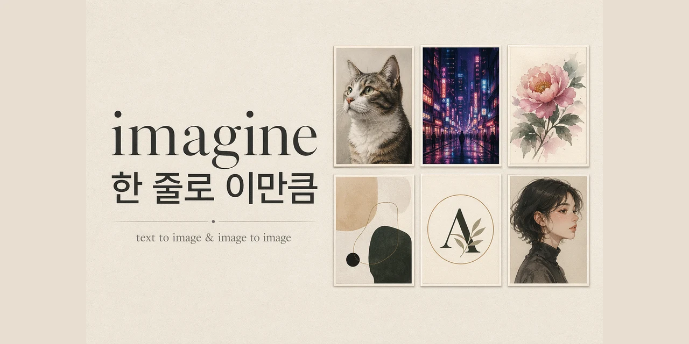

<div align="center">



# 🎨 imagine

### **"OpenAI API 키? 안 씁니다. ChatGPT 구독으로 끝."**

**Claude Code 안에서 `imagine ...` 한 줄이면 이미지가 튀어나옵니다.**

[](https://github.com/Mineru98/imagine)
[](./LICENSE)
[](https://docs.claude.com/claude-code)
[](https://nodejs.org)

</div>

---

## 🔥 왜 이게 화제냐면

> **매달 ChatGPT Plus $20 내고 있잖아요. 그거 이미 내고 있는데 왜 OpenAI Image API 크레딧을 또 삽니까?**

`imagine`은 여러분이 **이미 결제하고 있는 ChatGPT Plus/Pro 세션**을 재사용해서, Claude Code 안에서 구독 사용량 범위의 이미지를 생성합니다.

- 🔐 **API 키를 요구하지 않음** — 호스트 네이티브 이미지 도구 또는 ChatGPT 인증 브리지를 우선 사용합니다.
- 🤖 **Claude Code × ChatGPT 합법 동거** — Claude로 코딩하다가 `"imagine 사이버펑크 도시 3장"` 한 마디면 `./images/` 에 결과물이 착.
- 🎯 **"imagine"이라고만 말하면 끝** — 프롬프트 엔지니어링 몰라도 스킬이 알아서 size / quality / n 을 매핑합니다.
- 🖼️ **text→image 도 되고, image→image 리스타일도 됩니다** — 가지고 있던 사진을 수채화로, 로고를 네온 사인으로.
- 📦 **결과물은 프로젝트 안에** — 기본적으로 `./images/gpt-img2_<timestamp>_<index>.png` 로 저장합니다. 입력 이미지는 모델 기반 편집 시 설정된 생성 서비스로 전송됩니다.

> 이 프로젝트는 [ktkarchive/codex-imagegen-2-skill-for-kimi](https://github.com/ktkarchive/codex-imagegen-2-skill-for-kimi) (Kimi CLI용) 을 참고하여 **Claude Code 플러그인 포맷**으로 재구성한 포크입니다. 원작자분께 리스펙트 🙏

---

## ⚡ 30초 설치

### 1. Claude Code 마켓플레이스에서 플러그인 설치

```bash
# Claude Code 마켓플레이스에서 설치
/plugin marketplace add Mineru98/imagine
/plugin install imagine
```

끝입니다. 정말로. 두 줄.

### 2. ChatGPT 한 번만 로그인 (최초 1회)

```bash
npx @openai/codex login
```

브라우저가 열리면 평소 쓰는 ChatGPT 계정으로 로그인하세요. `~/.codex/auth.json` 에 세션이 저장됩니다.

### 3. 요구사항

| 항목 | 요구 버전 / 조건 |
|------|------------------|
| **Node.js** | ≥ 18 (native `fetch` 사용) |
| **ChatGPT 구독** | Plus 또는 Pro (이미지 쿼터가 붙어 있는 플랜) |
| **`npx`** | OAuth 프록시 자동 실행용 |

---

## 🎬 써먹는 법

Claude Code 세션 안에서 그냥 자연어로 말해보세요.

```
/imagine 미래도시의 야경, 네온 반사가 번쩍이는 젖은 거리, 3장 뽑아줘
```

```
/imagine 이 사진(./me.png)을 유화 스타일로 바꿔서 저장해줘
```

스킬이 자동으로:
- 프롬프트 → `--prompt`
- "3장" → `--n 3`
- "고퀄" / "detailed" → `--quality high`
- "세로 포스터" → `--size 1024x1536`

이렇게 매핑해서 스크립트를 돌립니다.

### 레거시 CLI를 명시적으로 사용할 때

일반 사용은 호스트 네이티브 이미지 도구를 권장합니다. 아래 로컬 CLI는
호환성 경로이며, 실행자가 명시적으로 `IMAGINE_ENABLE_LEGACY_PROXY=1`을
설정한 경우에만 동작합니다. API 키나 `auth.json`을 읽지 않습니다.

```bash
# text → image
IMAGINE_ENABLE_LEGACY_PROXY=1 node <skill-root>/scripts/generate.js \
  --prompt "a cyberpunk city at night, neon reflections on wet streets" \
  --quality high \
  --size 1024x1024 \
  --n 2

# image → image (리스타일)
IMAGINE_ENABLE_LEGACY_PROXY=1 node <skill-root>/scripts/edit.js \
  --input ./photo.png \
  --prompt "turn into a watercolor painting, soft pastels" \
  --out ./images/photo-watercolor.png
```

---

## 🧩 `imagine` 만 있는 게 아닙니다 — 8개 스킬 · 10개 에이전트

이 플러그인에는 용도별로 특화된 **스킬 8개**와, 그 뒤에서 특정 역할만 맡는 **에이전트 10개**가 같이 들어 있습니다. 전체 지도·사용 순서·금기는 [`docs/skills-and-agents.md`](./docs/skills-and-agents.md) 한 장으로 정리해뒀습니다.

빠른 요약:

| 쓰임새 | 스킬 |
|---|---|
| 일반 텍스트→이미지 / 이미지→이미지 | [`imagine`](./skills/imagine/SKILL.md) |
| 디자인 스크린샷 → HTML+Tailwind | [`image-to-code`](./skills/image-to-code/SKILL.md) |
| 랜딩 히어로 3:2 | [`imagine-hero`](./skills/imagine-hero/SKILL.md) |
| 발표 섹션 일러스트 세트 | [`imagine-slide`](./skills/imagine-slide/SKILL.md) |
| OG·소셜 카드 (+ `--bulk`) | [`imagine-og`](./skills/imagine-og/SKILL.md) |
| 로고 시안 (마크 + 워드마크 + SVG) | [`imagine-logo`](./skills/imagine-logo/SKILL.md) |
| iOS·Android·Web 아이콘 세트 | [`imagine-icon`](./skills/imagine-icon/SKILL.md) |
| UI 무드 보드 레퍼런스 | [`imagine-ui`](./skills/imagine-ui/SKILL.md) |

그리고 뒤에서 같이 움직이는 에이전트들:

- 프롬프트/스타일 보정: [`prompt-director`](./agents/prompt-director.md) · [`style-guardian`](./agents/style-guardian.md) · [`visual-critic`](./agents/visual-critic.md)
- `image-to-code` 파이프라인: [`vision-analyst`](./agents/vision-analyst.md) → [`layout-architect`](./agents/layout-architect.md) · [`design-token-extractor`](./agents/design-token-extractor.md) · [`asset-extractor`](./agents/asset-extractor.md) · [`a11y-advisor`](./agents/a11y-advisor.md) → [`code-generator`](./agents/code-generator.md) → [`visual-verifier`](./agents/visual-verifier.md)

각 스킬의 트리거 키워드·출력 경로·금기 규칙은 [`docs/skills-and-agents.md`](./docs/skills-and-agents.md) 참고.

---

## ⚙️ 조정 가능한 기본값

`skills/imagine/config.json` 을 고치면 전역 기본값이 바뀝니다.

```json
{
  "default_quality": "medium",
  "default_size": "1024x1536",
  "default_format": "png",
  "output_dir": "./images"
}
```

| 키 | 허용 값 |
|----|---------|
| `default_quality` | `low` \| `medium` \| `high` |
| `default_size` | `1024x1024` (1:1) \| `1024x1536` (2:3) \| `1536x1024` (3:2) |
| `default_format` | `png` (현재 runner는 PNG bytes만 검증) |
| `output_dir` | 아무 경로 (절대경로면 글로벌 수집함으로 사용 가능) |

---

## 🧠 동작 원리 (궁금한 분만)

```
Claude Code
    ↓ "imagine ..." 스킬 트리거
generate.js / edit.js
    ↓
host-native image tool / supported ChatGPT bridge
    ↓ PNG stream
./images/gpt-img2_<ts>_<i>.png  ← 자동 저장 + PNG 무결성 검증
```

레거시 proxy는 명시적으로 활성화한 경우에만 요청이 끝난 뒤 자식 프로세스를
종료합니다. 일반 경로는 호스트 네이티브 이미지 도구를 사용합니다.

---

## 🧯 트러블슈팅

| 증상 | 해결 |
|------|------|
| `Legacy OAuth proxy is disabled` | 호스트 네이티브 이미지 도구를 사용하거나, 호환성 실행에서만 `IMAGINE_ENABLE_LEGACY_PROXY=1` 설정 |
| `Proxy did not respond` | 직접 소유한 레거시 proxy만 중지하고 재시도. 일반 경로는 네이티브 이미지 도구로 전환 |
| `401` / `403` | 세션 만료 — 다시 로그인 |
| `Rate limit` | ChatGPT 티어 한도 초과 — 몇 분 쉬고 `--n` 줄이기 |

더 자세한 내용은 [`skills/imagine/reference/installation.md`](./skills/imagine/reference/installation.md) 참고.

---

## 📜 License

MIT © [Mineru](https://github.com/Mineru98)

---

<div align="center">

**⭐ 도움이 됐다면 [레포지토리에 스타 한번만](https://github.com/Mineru98/imagine) 눌러주세요.**

**Claude로 코딩 → `imagine` 한 줄 → 썸네일까지 뽑기. 워크플로우가 끊기지 않습니다.**

</div>
