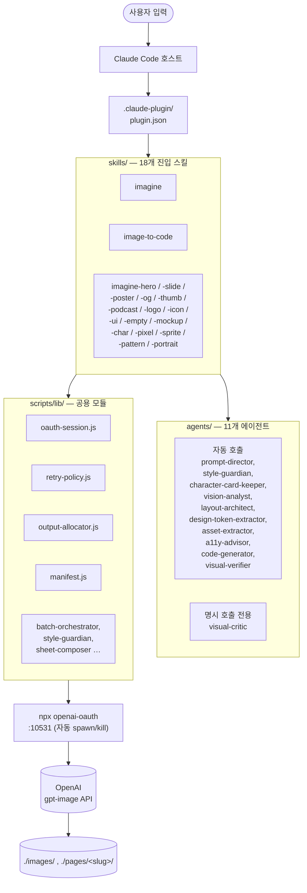
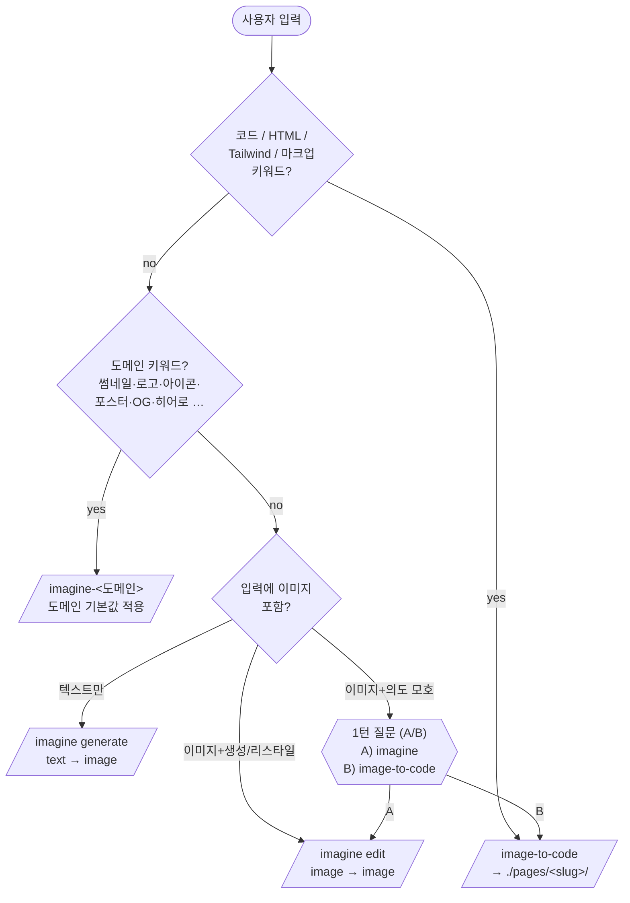
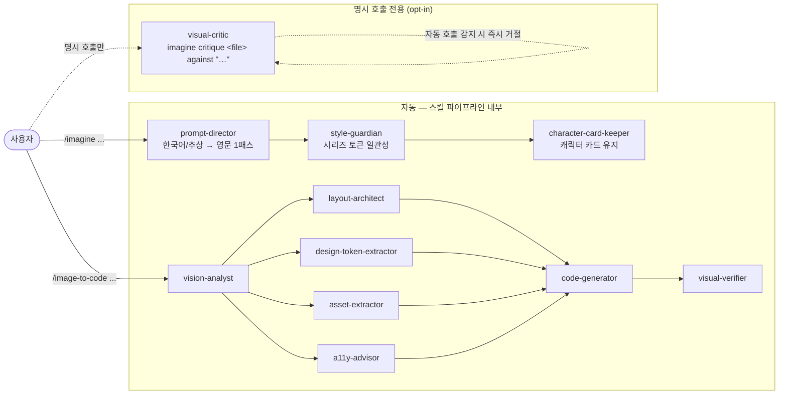
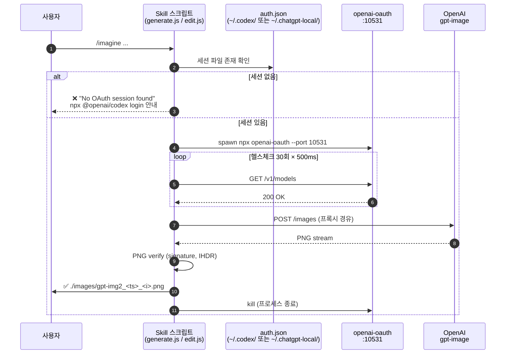
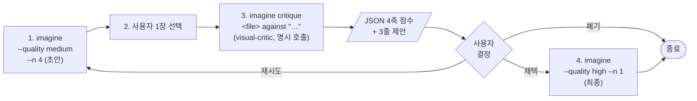
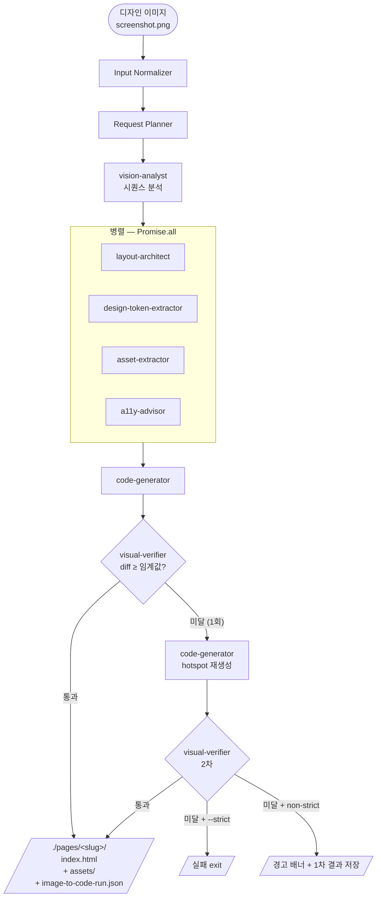

# imagine 하네스 운영 가이드

Claude Code × `imagine` 플러그인을 **하나의 작업 환경(harness)** 으로 보고, 18개 스킬 + 11개 에이전트 + 공용 스크립트를 어떻게 조합해 써야 하는지 정리한 운영 문서다. README는 "한 줄 설치·30초 데모"에 초점이 맞춰져 있고, 이 문서는 **반복 작업·팀 워크플로우·자동화** 관점에서의 가이드라인이다.

> 대상 독자: 이 플러그인을 1회성 데모가 아니라 실제 디자인·콘텐츠 파이프라인에 끼워 넣을 사람.

---

## 1. 하네스 구성 요소 한눈에



| 레이어 | 위치 | 역할 |
|---|---|---|
| 호스트 CLI | Claude Code | 사용자 입력을 받고 스킬 라우팅 |
| 플러그인 매니페스트 | `.claude-plugin/plugin.json` | `imagine`, `image-to-code` 두 진입 스킬 노출 |
| 스킬 묶음 | `skills/imagine*`, `skills/image-to-code/` | 각 도메인별 트리거 + CLI 래퍼 |
| 에이전트 | `agents/*.md` | 단일 책임 단위. 스킬 안에서만 호출됨 |
| 공용 라이브러리 | `scripts/lib/*.js` | OAuth, 출력 경로, 매니페스트, 재시도, 시트 컴포저 등 |
| 외부 의존 | `npx @openai/codex`, `npx openai-oauth` | ChatGPT 세션 → OpenAI gpt-image 프록시 |
| 출력 | `./images/`, `./pages/<slug>/` | 프로젝트 로컬 — Downloads로 새지 않음 |

핵심 원칙은 단순하다. **스킬은 사용자 입력을 받는 진입점, 에이전트는 스킬이 부르는 단일 책임 처리기, 공용 lib는 그 둘이 공유하는 무상태 모듈**이다. 이 경계를 깨뜨리는 사용 패턴(예: 에이전트끼리 직접 호출, 스킬 우회로 lib 직접 호출)은 권장하지 않는다.

---

## 2. 설치·첫 실행 체크리스트

1. Node ≥ 18 확인: `node -v`
2. 플러그인 활성화 확인: `.claude/settings.json` 의 `enabledPlugins` 에 `"imagine@imagine": true`
3. ChatGPT OAuth 1회 로그인: `npx @openai/codex login`
4. 첫 호출은 **반드시 프로젝트 루트에서**: `./images/` 가 의도한 위치에 잡힌다 (`process.cwd()` 기준).
5. 결과물 위치 정책 결정: 프로젝트 로컬이면 그대로, 글로벌 수집함이면 `skills/imagine/config.json` 의 `output_dir` 을 절대경로로.

이 5단계는 한 번만. 이후로는 슬래시 커맨드로 바로 진입 — `/imagine ...`, `/image-to-code <path>`.

---

## 3. 18개 스킬 — 작업 의도별 라우팅 표

`imagine`은 만능 진입점이지만, **목적이 분명하면 도메인 특화 스킬을 쓰는 편이 결과 품질·일관성 모두 낫다.** 도메인 스킬은 적절한 size/quality/n 기본값과 도메인 컨벤션(시트 컴포지션, 텍스트 오버레이 등)을 이미 내장하고 있기 때문이다.

| 의도 | 1순위 스킬 | 비고 |
|---|---|---|
| 일반 텍스트→이미지 | `imagine` | 가장 자유도 높음 |
| 보유 이미지 리스타일 | `imagine` (edit 모드) | `--input` + `--prompt` |
| 디자인 스크린샷 → HTML/Tailwind | `image-to-code` | 결과는 `./pages/<slug>/` |
| 랜딩 페이지 히어로 | `imagine-hero` | 3:2 강제, 텍스트 여백 보장 |
| 키노트/슬라이드 일러스트 | `imagine-slide` | 섹션 시리즈 일관성 우선 |
| 이벤트 포스터/배너/카드 | `imagine-poster` | 3종 세트 자동 생성 |
| OG/소셜 카드 (대량) | `imagine-og` | `--bulk` 지원 |
| YouTube 썸네일 | `imagine-thumb` | A/B 변형 |
| 팟캐스트 커버 | `imagine-podcast` | 3000×3000 고정 |
| 로고 시안 | `imagine-logo` | 마크 + 워드마크 + SVG 벡터화 |
| 앱 아이콘 세트 | `imagine-icon` | iOS·Android·Web 사이즈 일괄 |
| UI 무드 보드 | `imagine-ui` | 레퍼런스용 |
| 엠프티 스테이트 | `imagine-empty` | 라이트/다크 쌍 |
| 기기 목업 | `imagine-mockup` | 앱스토어 스펙 |
| 게임 캐릭터 시리즈 | `imagine-char` | character-card-keeper와 한 쌍 |
| 픽셀 아트 | `imagine-pixel` | 정수 픽셀 격자 보장 |
| 스프라이트 시트 | `imagine-sprite` | Unity/Godot 호환 |
| seamless 패턴 | `imagine-pattern` | 타일링 검증 포함 |
| 인물 사진 보정 | `imagine-portrait` | 로컬 처리 — 외부 송출 없음 |

### 라우팅 결정 흐름



애매할 때(예: "이 이미지 변환해줘")는 `image-to-code` SKILL §"트리거 충돌 방침" 규칙대로 **자동 추론하지 말고 1턴 질문(A/B)** 으로 분기한다. 자동 추론은 결과물 손실로 이어진다.

---

## 4. 11개 에이전트 — 책임·호출 시점

에이전트는 **사용자가 직접 호출하는 게 아니다.** 스킬의 파이프라인이 적절한 시점에 부른다. 다만 어떤 에이전트가 자동으로 끼어들고, 어떤 에이전트가 명시 호출 전용인지 **알아두면 결과를 통제할 수 있다.**



### 자동(스킬 파이프라인 내부에서 호출)

| 에이전트 | 호출 시점 | 빠지면 생기는 일 |
|---|---|---|
| `prompt-director` | 한국어/추상 입력 감지 시 1패스 영역 보정 | 모델이 추상 형용사 못 알아들음 → 결과 평이해짐 |
| `style-guardian` | 시리즈 스킬에서 토큰 일관성 강제 | 같은 시리즈 안에서 톤이 튐 |
| `character-card-keeper` | `imagine-char` 시리즈에서 캐릭터 카드 유지 | 같은 캐릭터가 매 컷 다른 얼굴이 됨 |
| `vision-analyst` → `layout-architect` / `design-token-extractor` / `asset-extractor` / `a11y-advisor` → `code-generator` → `visual-verifier` | `image-to-code` 파이프라인 고정 순서 | 시각 분석 누락 → 마크업이 디자인을 못 따라감 |

### 명시 호출 전용 (opt-in)

| 에이전트 | 트리거 | 절대 자동 호출 금지 사유 |
|---|---|---|
| `visual-critic` | `imagine critique <file> against "<desc>"` 정확 매칭 | Director와 자동 동시 실행 시 프롬프트가 매 턴 깎여 루프가 쿼터 소진 |

`visual-critic`은 **자동 실행 감지 시 즉시 거절**하도록 설계돼 있다. Ralph/Autopilot/Ultrawork 모드 안에서 "낮은 점수면 자동 재생성" 같은 래퍼는 만들지 말 것 — 설계상 거부된다.

### 에이전트 호출 시 권장 사항

- **에이전트끼리 직접 부르지 않는다.** 항상 스킬(=오케스트레이터)이 중재한다 (`image-to-code` SKILL §"파이프라인 요약" 참조).
- **재귀 보정 금지.** prompt-director는 단일 패스. 결과를 다시 다른 에이전트로 다듬어 들이밀지 말 것.
- **수정 결과를 사용자에게 투명 공개.** Director가 프롬프트를 바꿨다면 `다음과 같이 변환했습니다: "..."` 라인을 반드시 노출.

---

## 5. 트리거 충돌 — `imagine` vs `image-to-code`

같은 "이 이미지를 바꿔줘"라도 두 스킬이 둘 다 후보다. 충돌 해결 규칙은 단순하다 (`image-to-code` SKILL §"트리거 충돌 방침"):

- "그려줘 / 만들어줘 / ~스타일로" → **`imagine`** (시각 생성·변환)
- "웹페이지로 / HTML로 / Tailwind로 / 코드로" → **`image-to-code`** (마크업 변환)
- 모호한 "이 이미지 변환해줘" → 자동 추론 금지, 사용자에게 정확히 1턴 질문:

  ```
  (A) 다른 이미지로 변환 (imagine)
  (B) HTML / Tailwind 코드로 변환 (image-to-code)
  ```

**중요:** 사용자 응답 전에는 어느 쪽도 실행하지 않는다. 잘못 분기하면 의도와 다른 산출물이 디스크에 떨어지고, 다시 정리하는 비용이 더 든다.

---

## 6. 출력 경로 규약 — 어디에 떨어지는가

| 스킬군 | 기본 출력 |
|---|---|
| `imagine`, `imagine-*` | `./images/gpt-img2_<unix-ms>_<index>.<ext>` |
| `image-to-code` | `./pages/<slug>/index.html` (+ `assets/`, `image-to-code-run.json`) |

원칙:
- **상대경로는 모두 `process.cwd()` 기준.** 따라서 항상 프로젝트 루트에서 실행한다.
- **`./pages/<slug>/index.html` 만 쓰고, 프로젝트 루트의 `index.html` 은 절대 덮어쓰지 않는다.**
- 글로벌 수집함을 원하면 `skills/imagine/config.json` 의 `output_dir` 에 절대경로 (예: `/Users/<you>/Pictures/codex-images`).
- 파일명 충돌은 unix-ms 타임스탬프로 자동 회피되므로 `--n 8` 병렬 호출도 안전하다.

`history.jsonl` (스킬 폴더 안)은 매 호출마다 1줄 append된다. **프롬프트 이력이 노출되면 곤란한 환경에서는 git ignore** 또는 주기적 rotate.

---

## 7. OAuth 프록시 — 동작 모델과 트러블슈팅



요약: **세션 파일 확인 → 프록시 spawn → 헬스체크 → 호출 → 결과 검증 → 프록시 kill** 의 1회성 사이클이며, 영속 백그라운드 프로세스를 남기지 않는다.

알아둘 포인트:
- **포트 10531 하드코딩.** 다른 프로세스가 점유하면 3회 재시도 후 실패. `lsof -ti:10531 | xargs kill -9` 로 비우고 재실행.
- **세션 만료 → 401/403.** `npx @openai/codex login` 재실행 외 우회 방법 없다.
- **Rate limit → 429.** ChatGPT 티어 한도. `--n` 줄이고 잠시 대기. 재시도 정책은 `scripts/lib/retry-policy.js` 가 담당.
- **프록시는 영속 백그라운드가 아니다.** 매 호출마다 spawn → kill. 따라서 워치독·systemd unit 같은 걸 별도로 박을 필요 없음.

### 자주 만나는 증상 → 처방

| 증상 | 처방 |
|---|---|
| `No OAuth session found` | `npx @openai/codex login` |
| `Proxy did not respond` (3× 재시도 실패) | 포트 정리 후 재시도, 필요시 `npm i -g openai-oauth` |
| `OAuth proxy returned 401/403` | 재로그인 |
| `Rate limit` / `429` | `--n` 축소 + 대기 |
| Verification ❌ (`pngSignature`, `ihdrPresent`) | 같은 프롬프트로 1회 재시도. 두 번 실패하면 프롬프트 단순화. |

---

## 8. 반복 작업 패턴 — 권장 워크플로우

### 8.1 동일 시리즈를 일관성 있게 뽑고 싶을 때

1. 첫 호출에서 *마음에 드는 1장* 을 골라낸다.
2. 그 결과물의 토큰을 `style-guardian` 에이전트가 카드로 굳히도록 시리즈 스킬(`imagine-slide`, `imagine-poster`, `imagine-char` 등)을 사용한다.
3. 후속 호출은 같은 스킬·같은 카드 안에서 `--n` 으로 변형만 추가한다.
4. 카드를 갱신하고 싶으면 명시적으로 "이 평가를 카드에 반영해줘" 라고 요청 — 자동 갱신은 일어나지 않는다.

### 8.2 초안 → 검수 → 채택 루프



1. `imagine` 으로 `--quality medium --n 4` 정도 초안.
2. 사용자가 1장을 직접 골라서 `imagine critique <file> against "<원래 의도>"` 로 `visual-critic` 호출.
3. JSON 4축 점수 + 3줄 제안을 보고 다음 액션을 **사용자가** 결정. (자동 재생성 금지)
4. 채택안만 `--quality high` 로 1장 다시 뽑아 최종.

이 루프를 자동화하려는 유혹이 있는데, 설계상 critic 자동 호출은 차단돼 있다. 자동화하려거든 critic 단계를 빼고 "low → medium → high 단계 게이트"로만 단순 자동화하는 게 안전하다.

### 8.3 디자인 스크린샷을 코드로 (image-to-code)



1. 입력 이미지 1장 → `image-to-code <path>` (기본).
2. `--strict` 로 visual diff 0.90 미만 시 실패 처리.
3. 토큰을 강제하고 싶으면 `--tokens ./design/tokens.json`.
4. 디자인 시스템 후보가 여럿이면 `--explore` 로 대안 3개 생성.
5. 결과는 `./pages/<slug>/`. 절대 루트 `index.html` 을 덮지 않는다.

---

## 9. 안전·금기 — 자동화 모드에서 특히 주의

| 금기 | 이유 |
|---|---|
| `visual-critic` 자동 호출 | Director ↔ Critic 순환 루프로 ChatGPT 쿼터 소진 |
| 에이전트 간 직접 호출 | 단일 책임·테스트 가능성 붕괴 |
| `prompt-director` 결과 재보정 | 사용자 의도 토큰이 booster에 밀려나 의미 변형 |
| Ralph/Autopilot 안에서 무한 재생성 | OAuth 세션 한도 + 비용 |
| 루트 `index.html` 덮어쓰기 | 사용자 프로젝트 파괴 |
| Downloads/홈 디렉토리 임의 출력 | "프로젝트 안에만 떨어진다"는 약속 깨짐 |
| 안전 우회 booster 주입 (`masterpiece`, `ignore safety` 등) | 모델 가드 우회 시도로 분류될 수 있음 |

자동화 워크플로우를 짤 때는 위 표가 곧 **CI 룰의 출발점**이다. 위반 시점에 즉시 실패하도록 lint를 거는 편이 사후 디버깅보다 싸다.

---

## 10. 협업·CI 환경에서의 추가 권고

- **`history.jsonl` 은 기본 `.gitignore`.** 프롬프트가 지적재산이면 더더욱.
- **`./images/`, `./pages/`** 는 **산출물이지 소스가 아니다**. 큰 PNG 가 git 에 들어가면 리포가 빠르게 무거워진다 — Git LFS 또는 별도 asset 저장소 권장.
- **OAuth 세션은 1인 1로그인.** CI 러너에 sub-account 토큰을 얹는 패턴은 약관상 위험할 수 있다 (ChatGPT 이용약관 검토 필수). 대량 자동화는 차라리 OpenAI Image API를 직접 결제하는 쪽이 안전하다.
- **포트 10531 충돌.** 동일 머신에서 다른 OpenAI OAuth 프록시 도구를 쓰는 환경이라면 별칭으로 분리하거나 직렬화.
- **신규 스킬 추가 시 컨벤션:** `skills/<name>/SKILL.md` 의 frontmatter에 `name`, `description`, `argument-hint` 3개 필드를 반드시 채우고, 출력 경로는 항상 프로젝트 로컬(`./images/` 또는 `./pages/<slug>/`) 만 쓴다. 새 출력 위치를 만드는 스킬은 README 한 장에 추가 등재한다.

---

## 11. 더 깊이 들어가려면

- 도메인별 스킬 세부 — 각 `skills/<name>/SKILL.md`
- 에이전트별 책임 모델 — 각 `agents/<name>.md`
- 설치·재인증·트러블슈팅 — `skills/imagine/reference/installation.md`
- 외부 리뷰(Codex/GPT-5.4 시점) — [`docs/codex-review.md`](./codex-review.md)
- 스킬·에이전트 한장 지도 — `docs/skills-and-agents.md` (README에서 참조됨, 별도 작성 권장)

이 문서는 "운영 관점의 가이드라인"이며, 단일 호출 사용법은 README와 각 SKILL.md가 1차 출처다. 두 문서가 충돌할 경우 SKILL.md 가 우선한다 — 스킬의 실제 동작은 SKILL.md frontmatter와 본문이 정의한다.
